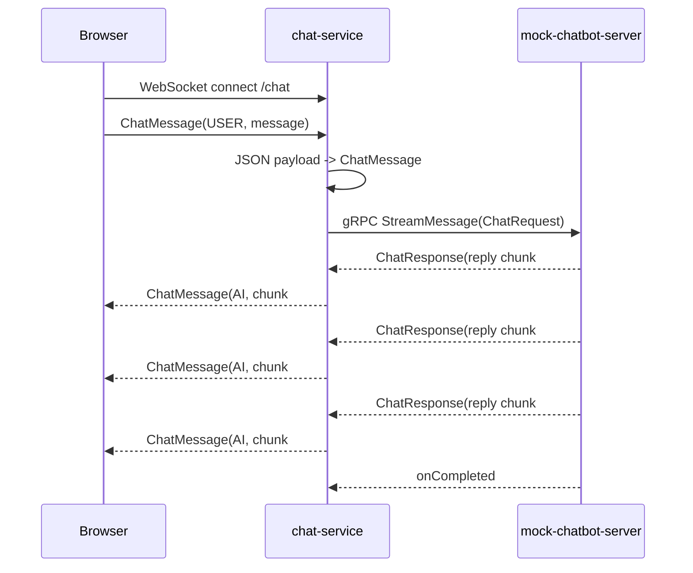

# 아키텍처

## 목표

AI 응답이 지연되는 채팅 환경에서 WebSocket 연결을 유지하면서 응답 생성 흐름을 gRPC server streaming으로 분리하는 구조를 검증

| 비교 항목 | 기존 문제 상황 | refactor 검증 구조 |
| --- | --- | --- |
| WebSocket 처리 | Spring MVC 기반 blocking 흐름 | WebFlux 기반 non-blocking 흐름 |
| AI 서버 호출 | HTTP(S) 요청/응답 | gRPC server streaming |
| AI 응답 처리 | 전체 응답을 기다린 뒤 전달 | stream chunk를 받는 즉시 전달 |
| 응답 체감 | 전체 답변 완료까지 대기 | 첫 chunk부터 점진적으로 수신 |
| 검증 방식 | 실제 chatbot 의존 | mock gRPC 서버로 지연 응답 재현 |

## 컴포넌트

| 컴포넌트 | 역할 |
| --- | --- |
| `chat-service` | WebSocket 연결 처리, 사용자 메시지 수신, AI 응답 chunk 전달 |
| `mock-chatbot-server` | 실제 chatbot을 대체하는 테스트용 gRPC streaming 서버 |
| `experiments/k6` | WebSocket 연결과 streaming 응답 부하 테스트 |
| `observability-stack` | Prometheus/Grafana 기반 관측 환경 |

`chat-service`는 WebSocket boundary와 gRPC adapter boundary를 분리

gRPC callback은 Reactor `Flux`로 변환해 WebSocket 응답 stream에 연결

## 채팅 흐름

동일 WebSocket 세션의 연속 메시지는 `concatMap`으로 처리해 앞 응답 stream이 끝난 뒤 다음 메시지를 처리

## 실험 엔드포인트

| Protocol | Path | 목적 |
| --- | --- | --- |
| `HTTP` | `/` | 테스트용 static chat UI 제공 |
| `WebSocket` | `/chat` | 사용자 메시지 수신과 AI 응답 chunk 전달 |
| `gRPC` | `ChatService.StreamMessage` | AI 응답을 server streaming으로 반환 |
| `HTTP` | `/actuator/health` | chat-service 헬스 체크 |
| `HTTP` | `/actuator/prometheus` | Prometheus scrape용 메트릭 노출 |

WebSocket 메시지는 `sender`, `message`, `type` 필드를 가진 JSON 형식을 사용

gRPC 계약은 `chat-service`와 `mock-chatbot-server`가 같은 proto 파일을 공유

## 트레이드오프

### HTTP(S) 요청/응답 -> gRPC server streaming

- AI 응답을 완성본으로 받지 않고 chunk 단위로 받을 수 있어 첫 응답 전달 시간이 줄어듦
- proto 계약을 공유하므로 서비스 간 메시지 형식이 명확해짐
- gRPC client/server, proto generation, streaming callback 처리 코드가 추가됨
- 브라우저와 직접 통신하는 구간은 여전히 WebSocket이 필요하고 gRPC는 내부 서비스 간 통신에 사용

### Spring MVC -> WebFlux

- 긴 AI 응답 대기 중에도 요청 처리 thread를 점유하는 부담을 줄일 수 있음
- WebSocket stream과 gRPC stream을 Reactor `Flux`로 이어 붙이기 쉬움
- MVC보다 reactive 흐름의 디버깅, 에러 처리, backpressure 이해 비용이 높음
- blocking 라이브러리를 섞으면 WebFlux 전환 효과가 줄어들 수 있음